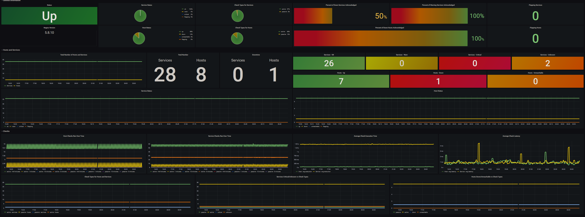

<p align="center">
  
</p>


# nagios_exporter

[](https://github.com/wbollock/nagios_exporter/blob/master/LICENSE)
[](https://github.com/wbollock/nagios_exporter/actions/workflows/golangci-lint.yaml)

[](https://github.com/wbollock/nagios_exporter/issues)

A Prometheus exporter currently supporting:

* Nagios XI
* Nagios Core 4
* Nagios Core 3
* CheckMK

It includes metrics on the current state and configuration of Nagios. This includes the number of hosts, services, and information about their monitoring setup. For example, this exporter will output the number of flapping hosts, passive checks, or hosts in downtime.

Practical use cases for this exporter may include:

* A Nagios overview - see broad status of hosts and services
* Visualize changes in host status after making adjustments to Nagios checks
* Detect an uptick in `unknown` check results after converting many active checks to passive

This exporter does not output Nagios check results as Prometheus metrics; it is designed to export metrics of the Nagios monitoring server itself for meta-monitoring.

## Table of Contents

- [nagios\_exporter](#nagios_exporter)
  - [Table of Contents](#table-of-contents)
  - [Configuration](#configuration)
    - [Nagios Core 3/4 support](#nagios-core-34-support)
  - [Installation](#installation)
    - [Debian/RPM package](#debianrpm-package)
    - [Binary](#binary)
    - [Source](#source)
  - [Grafana](#grafana)
  - [Troubleshooting](#troubleshooting)
    - [NagiosXI](#nagiosxi)
    - [Nagios Core 3/4, CheckMK](#nagios-core-34-checkmk)
  - [Resources Used](#resources-used)
  - [Contributors ✨](#contributors-)

## Configuration

Create a simple `config.toml` in `/etc/prometheus-nagios-exporter` with your Nagios API key:

```toml
# prometheus-nagios-exporter configuration

APIKey = ""
```

By default this will point to `http://localhost`, but a remote address can be specified with `--nagios.scrape-uri`. The default port is `9927`, but can be changed with `--web.listen-address`.

SSL support is included for scraping remote Nagios endpoints, and SSL verification can be enabled/disabled with `--nagios.ssl-verify`. A scrape timeout value is also available with `--nagios.timeout`.

```bash
./nagios_exporter --nagios.scrape-uri https://<my-tls-url> --nagios.ssl-verify true --nagios.timeout 5
```

To see all available configuration flags:

```bash
./prometheus-nagios-exporter -h
```

### Nagios Core 3/4 support

This exporter also supports Nagios Core 3/4 and CheckMK, albeit with a subset of metrics and reliance on the `nagiosstats` binary. There is no RESTful API for either monitoring platform, so the exporter must be run directly on the Nagios host and have access to execute `nagiostats`.

It is also recommended to pass the path of the Nagios configuration

Typical location and usage of the binary:

* Nagios Core 3/4:
  * `--nagios.stats_binary`: `/usr/local/nagios/bin/nagiostats`
  * `--nagios.config_path`: `/usr/local/nagios/etc/nagios.cfg`
* CheckMK:
  * `--nagios.stats_binary`: `/omd/sites/<your-site>/bin/nagiostats`
  * `--nagios.config_path`: `/omd/sites/<your-site>/tmp/nagios/nagios.cfg`

Example usage:

```bash
./nagios_exporter --nagios.stats_binary "/usr/local/nagios/bin/nagiostats" --nagios.config_path "/usr/local/nagios/etc/nagios.cfg"
```

Note that this flag nullifies all others. It cannot be used in conjunction with the Nagios XI API.

## Installation

### Debian/RPM package

Substitute `{{ version }}` for your desired release.

```bash
wget https://github.com/wbollock/nagios_exporter/releases/download/v{{ version }}/prometheus-nagios-exporter_{{ version }}_linux_amd64.{deb,rpm}
{dpkg,rpm} -i prometheus-nagios-exporter_{{ version }}_linux_amd64.{deb,rpm}
```

### Binary

```bash
wget https://github.com/wbollock/nagios_exporter/releases/download/v{{ version }}/nagios_exporter_{{ version }}_Linux_x86_64.tar.gz 
tar xvf nagios_exporter_{{ version }}_Linux_x86_64.tar.gz
./nagios_exporter/prometheus-nagios-exporter
```

### Source

```bash
wget https://github.com/wbollock/nagios_exporter/archive/refs/tags/v{{ version }}.tar.gz
tar xvf nagios_exporter-{{ version }}.tar.gz
cd ./nagios_exporter-{{ version }}
go build nagios_exporter.go
./nagios_exporter.go
```

## Grafana

Import the [dashboard](grafana/dashboard.json) template ([instructions](https://grafana.com/docs/grafana/v9.0/dashboards/export-import/#import-dashboard)).

 

## Troubleshooting

Ensure `nagios_up` returns `1`.

### NagiosXI

Please check your API key and Nagios reachability:

```bash
curl -GET "http://<nagios_url>/nagiosxi/api/v1/objects/host?apikey=<apikey>&pretty=1"
```

### Nagios Core 3/4, CheckMK

Ensure the user running the Nagios Exporter can execute `nagiostats` fully:

```bash
sudo su <prometheus-user> -s /bin/bash -c "/usr/local/nagios/bin/nagiostats -c /usr/local/nagios/etc/nagios.cfg"
```

## Resources Used

* [haproxy_expoter](https://github.com/prometheus/haproxy_exporter/blob/main/haproxy_exporter.go)
* [15 Steps to Write an Application Prometheus Exporter in GO](https://medium.com/teamzerolabs/15-steps-to-write-an-application-prometheus-exporter-in-go-9746b4520e26)
* [curl-to-go](https://mholt.github.io/curl-to-go/)
* [mirth_exporter](https://github.com/teamzerolabs/mirth_channel_exporter)
* [golang-json-api-client](https://blog.alexellis.io/golang-json-api-client/)
* [jsonutils](https://github.com/bashtian/jsonutils)
* [goreleaser](https://github.com/goreleaser/goreleaser)
* [nfpm](https://github.com/goreleaser/nfpm)

## Contributors ✨

<!-- ALL-CONTRIBUTORS-LIST:START - Do not remove or modify this section -->
<!-- prettier-ignore-start -->
<!-- markdownlint-disable -->
<table>
  <tbody>
    <tr>
      <td align="center"><a href="https://github.com/tjhop"><br /><sub><b>TJ Hoplock</b></sub></a><br /><a href="https://github.com/wbollock/nagios_exporter/commits?author=tjhop" title="Code">💻</a> <a href="#mentoring-tjhop" title="Mentoring">🧑‍🏫</a></td>
    </tr>
  </tbody>
</table>

<!-- markdownlint-restore -->
<!-- prettier-ignore-end -->

<!-- ALL-CONTRIBUTORS-LIST:END -->

This project follows the [all-contributors](https://github.com/all-contributors/all-contributors) specification.
